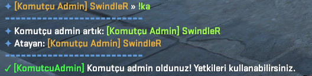
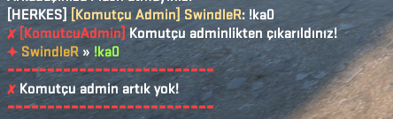
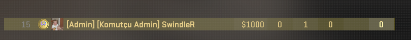
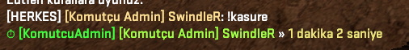
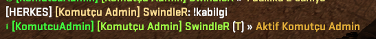
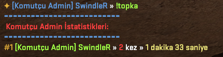
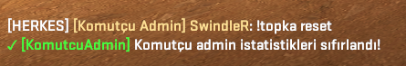

# 🔫 CS2 Plugin - [Komutcu Admin Plugin]

## Discord: https://discord.gg/YmaDNa8kjw

---

## 📌 Description

This plugin is a custom extension developed for Counter-Strike 2 servers. It offers the following features:

---

- ✅ This plugin works in Jailbreak modes.
- ✅ It is a plugin for assigning a Commanding Admin.
- ✅ The commands of this plugin can be used by admins.
- ✅ When installed on the server, it automatically creates a config file. You can customize various settings in this file, such as the ChatTag, Commanding Admin tag, command prefixes, Commanding Admin permissions, admin immunity level, command usage permissions, and more.

---

## 🧩 Requirements

- Counter-Strike 2 (dedicated server)
- CounterStrikeSharp

---

## 🛠️ Installation

### 1) Download the Plugin

- Download the latest release from:  
 👉 [Releases](https://github.com/SwindleR-b/CS2-KomutcuAdmin/releases)

### 2) Install the Plugin

Place the plugin in the following directory:

_cs2/addons/counterstrikesharp/plugins/_

### 3) Start / Reload the Plugin

To activate:

- Restart your server  
  **OR**
- Run the following command in the server console:
css_plugins load SwindleR-KomutcuAdmin

---

## ⚙️ Commands

|    Command      |                                                          Description                                                   |
|-----------------|------------------------------------------------------------------------------------------------------------------------|
| `!ka "name"`    | Assigns the Commanding Admin.                                                                                          |
| `!ka0`          | Removes the Commanding Admin from their role.                                                                          |
| `!kabilgi`      | Displays who the active Commanding Admin is.                                                                           |
| `!kasure`       | Shows how long the Commanding Admin has been active in their role.                                                     |
| `!topka`        | Lists the players who have held the Commanding Admin role the most, in a Top 10 format of all time.                    |
| `!topka reset`  | Players with the **@css/root** permission can reset the Top 10 list.                                                   |

---

## 📁 Configuration File
After restarting your server, a configuration file will be automatically generated at:

_cs2/addons/counterstrikesharp/config/plugins/SwindleR-KomutcuAdmin/SwindleR-KomutcuAdmin.json _

- You can make any desired adjustments to this configuration file and customize it to suit your needs.
- You can edit any messages and configure language settings through the lang file.

---

## 📸 Screenshots

Here are some in-game screenshots of the plugin in action:

  </b> !ka </b> 
                                             

  

 </b> !ka0 </b> 
 

  

 </b> SCOREBOARD TAG </b> 
 

  

 </b> !kasure </b> 
 

  

 </b> !kabilgi </b> 
 

  

 </b> !topka </b> 
 

  

 </b> !topka reset </b> 
 

  

---

